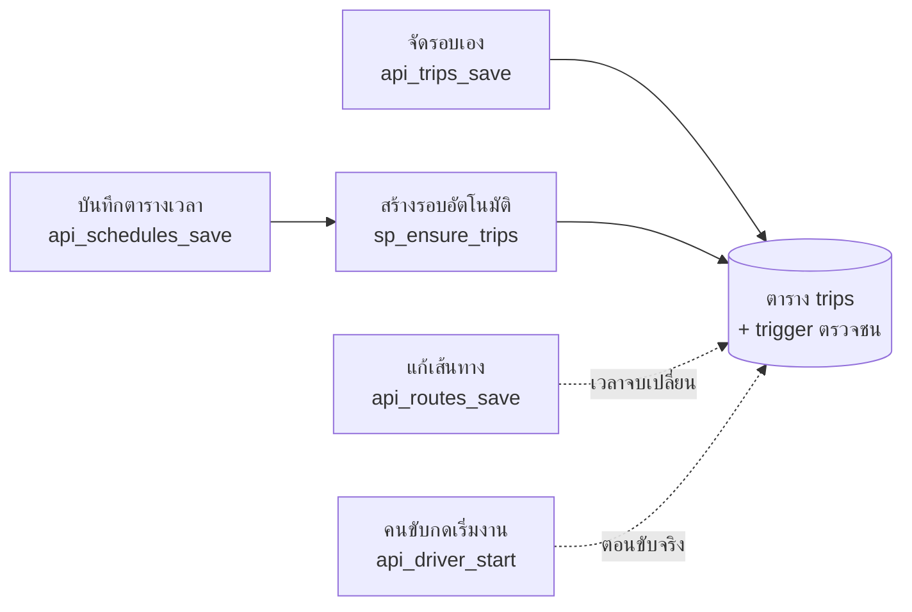

# BusBuddy ทำงานอย่างไร

เอกสารนี้อธิบายว่าโค้ดแต่ละส่วนทำงานอย่างไร โดยเน้นจุดที่ระบบ**ป้องกันรอบรถชนกัน**
ตัวอย่างโค้ดคัดจากฉบับ MySQL (`database/api_procedures.sql`, `database/mut_shuttle.sql`)
ฉบับ Oracle (`*_oracle.sql`) ใช้ชื่อ procedure และกติกาเดียวกันทุกข้อ ต่างกันแค่ไวยากรณ์ ส่วนที่ต่างกันมากจะยกมาให้ดูด้วย

> วิธีติดตั้ง รายชื่อหน้าเว็บ และ procedure ที่แต่ละหน้าเรียก ดูได้ที่ [README](../README.md)

**สารบัญ**

1. [ภาพรวม: ทุกกติกาอยู่ในฐานข้อมูล](#1-ภาพรวม-ทุกกติกาอยู่ในฐานข้อมูล)
2. [การป้องกันรอบรถชนกัน (6 ด่าน)](#2-การป้องกันรอบรถชนกัน-6-ด่าน)
3. [ทุกรอบต้องมีคนขับที่ขับได้จริง](#3-ทุกรอบต้องมีคนขับที่ขับได้จริง)
4. [การป้องกันจองที่นั่งเกิน](#4-การป้องกันจองที่นั่งเกิน)
5. [สิทธิ์และสถานะบัญชี](#5-สิทธิ์และสถานะบัญชี)

---

## 1. ภาพรวม: ทุกกติกาอยู่ในฐานข้อมูล

```
เบราว์เซอร์ (public/*.html + js)  →  server.js  →  stored procedure api_*  →  ตาราง / trigger
```

หน้าเว็บไม่ได้คุยกับฐานข้อมูลตรง ๆ ทุกคำขอผ่าน `server.js` ซึ่งไม่มีกติกาของระบบอยู่เลย มีหน้าที่แค่ส่งต่อคำขอไปเรียก procedure ชื่อ `api_<ชื่อ>`

```js
// server.js — POST /api/trips_list  →  CALL api_trips_list(p_uid, p_date, ...)
app.post('/api/:name', async (req, res) => {
  const proc = `api_${String(req.params.name).toLowerCase()}`;
  if (!req.session.uid) return res.status(401).json({ error: 'กรุณาเข้าสู่ระบบก่อนใช้งาน', login: true });
  const body = req.body || {};
  // จับคู่พารามิเตอร์ตามชื่อ: p_driver_name ← body.driver_name / p_uid มาจาก session เสมอ (หน้าเว็บปลอมไม่ได้)
  const callApi = () => call(proc, apiParams[proc].map((p) => (p === 'p_uid' ? req.session.uid : toArg(body[p.replace(/^p_/, '')]))));
  // …
});
```

- รายชื่อพารามิเตอร์ของแต่ละ procedure อ่านจากฐานข้อมูลเอง (`information_schema` / `user_arguments`) เพิ่ม procedure ใหม่จึงไม่ต้องแก้ `server.js`
- ถ้ามีคนแก้พารามิเตอร์ของ procedure (`npm run db:api`) ระหว่างที่เว็บเปิดอยู่ server จะโหลดรายชื่อใหม่แล้วเรียกซ้ำเอง 1 ครั้ง

### procedure แจ้ง error อย่างไร

procedure ส่งข้อความรูปแบบ `ช่อง|ข้อความ` แล้ว `server.js` แปลงเป็น HTTP status

```js
// server.js — toError()
if (m[1] === '!denied')   return { status: 403, error: m[2] };                 // ไม่มีสิทธิ์
if (m[1] === '!login')    return { status: 401, error: m[2], login: true };    // บัญชีถูกปิด → หน้าเว็บพาไปหน้า login
if (m[1] === '!notfound') return { status: 404, error: m[2] };                 // ไม่พบข้อมูล
return { status: 400, error: m[2], field: m[1] };                              // แสดงข้อความใต้ช่อง m[1] ในฟอร์ม
```

```sql
-- ตัวอย่างใน procedure: error นี้จะขึ้นใต้ช่อง "คนขับ" ในฟอร์ม
SIGNAL SQLSTATE '45000' SET MESSAGE_TEXT = 'driver_id|คนขับคนนี้มีงานในตารางเวลา TS001 …';
```

---

## 2. การป้องกันรอบรถชนกัน (6 ด่าน)

### นิยามของ "ชน"

สองงาน**ชนกัน**เมื่อใช้**รถคันเดียวกัน**หรือ**คนขับคนเดียวกัน** และช่วงเวลาทับกัน

```
เวลาจบ = เวลาออก + เวลาเดินทางรวมของเส้นทาง (ผลรวม route_stops.travel_minutes)
ทับกัน  ⇔  เริ่ม A < จบ B  และ  เริ่ม B < จบ A
```

ตัวอย่าง: รอบ 09:30 ของเส้นทางที่ใช้เวลา 30 นาที จบ 10:00
- รอบถัดไปของคนขับคนเดียวกันออก **09:45** → ชน
- ออก **10:00** พอดี → ไม่ชน
- รอบที่สถานะ "ยกเลิก" ไม่นับ



### ด่าน 1: Trigger ในตาราง `trips` (ด่านสุดท้าย)

ทุกครั้งที่มีการเพิ่มหรือแก้แถวในตาราง `trips` ไม่ว่าจากหน้าเว็บ จาก procedure หรือจาก SQL ตรง ๆ ฐานข้อมูลจะตรวจชนเอง ถ้าชนจะปฏิเสธทั้งคำสั่ง
ด่านอื่นทั้งหมดอาจมีช่องโหว่ได้ แต่ด่านนี้ข้ามไม่ได้

```sql
-- database/mut_shuttle.sql — trg_trips_bi (ตอนเพิ่มรอบ) ส่วนตรวจคนขับ
SELECT t.trip_id INTO v_conflict
FROM trips t
WHERE t.trip_date = NEW.trip_date AND t.status <> 'ยกเลิก' AND t.driver_id = NEW.driver_id
  AND TIMESTAMP(t.trip_date, t.depart_time) <                       -- เริ่มรอบเดิม < จบรอบใหม่
      TIMESTAMP(NEW.trip_date, NEW.depart_time) + INTERVAL v_total MINUTE
  AND TIMESTAMP(NEW.trip_date, NEW.depart_time) <                   -- เริ่มรอบใหม่ < จบรอบเดิม
      TIMESTAMP(t.trip_date, t.depart_time)
      + INTERVAL (SELECT COALESCE(SUM(x.travel_minutes), 0) FROM route_stops x WHERE x.route_id = t.route_id) MINUTE
LIMIT 1;
IF v_conflict IS NOT NULL THEN
  SET v_msg = CONCAT('ไม่สามารถจัดรอบนี้ได้ เนื่องจากคนขับมีงานรอบ ', v_conflict, ' ในช่วงเวลาเดียวกัน');
  SIGNAL SQLSTATE '45000' SET MESSAGE_TEXT = v_msg;
END IF;
```

- `trg_trips_bu` (ตอนแก้รอบ) ตรวจเฉพาะเมื่อเปลี่ยนวัน เวลา รถ คนขับ เส้นทาง หรือเปิดรอบที่ยกเลิกไปแล้วกลับมา
- **Oracle** อ่านตาราง `trips` ระหว่างที่กำลังแก้ตารางเดียวกันใน trigger แบบแถวต่อแถวไม่ได้ (ข้อผิดพลาด *mutating table*) จึงใช้ **COMPOUND TRIGGER** เก็บรหัสรอบที่เปลี่ยนไว้ก่อน แล้วค่อยตรวจหลังคำสั่งจบ

```sql
-- database/mut_shuttle_oracle.sql — trg_trips_conflict
CREATE OR REPLACE TRIGGER trg_trips_conflict
FOR INSERT OR UPDATE ON trips
COMPOUND TRIGGER
  TYPE t_ids IS TABLE OF VARCHAR2(10);
  g_ids t_ids := t_ids();

  AFTER EACH ROW IS            -- จดรหัสรอบที่ต้องตรวจไว้ก่อน
  BEGIN
    IF :NEW.status <> 'ยกเลิก' AND (INSERTING OR :NEW.driver_id <> :OLD.driver_id /* … */) THEN
      g_ids.EXTEND;
      g_ids(g_ids.COUNT) := :NEW.trip_id;
    END IF;
  END AFTER EACH ROW;

  AFTER STATEMENT IS           -- คำสั่งจบแล้ว อ่านตาราง trips ได้
  BEGIN
    FOR i IN 1 .. g_ids.COUNT LOOP
      -- หา trip อื่นที่ใช้รถ/คนขับเดียวกันและเวลาทับกัน → RAISE_APPLICATION_ERROR
    END LOOP;
  END AFTER STATEMENT;
END trg_trips_conflict;
```

### ด่าน 2: จัดหรือแก้รอบ `api_trips_save`

ตรวจก่อนถึง trigger เพื่อให้ได้ข้อความที่บอกช่วงเวลาชัด ๆ และขึ้นใต้ช่องที่ผิด ตรวจ 2 อย่าง

**(ก) ชนกับรอบอื่นที่มีอยู่แล้ว**

```sql
-- database/api_procedures.sql — api_trips_save
SET v_conflict = (
  SELECT CONCAT(trip_id, ' (', TIME_FORMAT(depart_time, '%H:%i'), '–', TIME_FORMAT(end_at, '%H:%i'), ')')
    FROM v_trip_details
   WHERE trip_date = v_date AND status <> 'ยกเลิก' AND trip_id <> COALESCE(NULLIF(p_id, ''), '-')
     AND driver_id = p_driver_id
     AND TIMESTAMP(trip_date, depart_time) < TIMESTAMP(v_date, v_time) + INTERVAL v_minutes MINUTE
     AND TIMESTAMP(v_date, v_time) < end_at
   LIMIT 1);
IF v_conflict IS NOT NULL THEN
  SET v_msg = CONCAT('driver_id|ไม่สามารถจัดรอบนี้ได้ เนื่องจากคนขับมีงานรอบ ', v_conflict);
  SIGNAL SQLSTATE '45000' SET MESSAGE_TEXT = v_msg;
END IF;
```

**(ข) ชนกับตารางเวลาที่ยังไม่ได้สร้างเป็นรอบ**
ระบบสร้างรอบจากตารางเวลาล่วงหน้าแค่ 8 วัน ถ้าจัดรอบเองล่วงหน้า 20 วัน trigger จะยังไม่เห็นรอบจากตารางเวลาของวันนั้น จึงต้องตรวจตารางเวลาด้วย

```sql
-- api_trips_save (ต่อ)
FROM trip_schedules s JOIN v_route_totals rt ON rt.route_id = s.route_id
WHERE s.active = 1
  AND (s.vehicle_id = p_vehicle_id OR s.driver_id = p_driver_id)
  AND mut_runs_on(s.run_days, v_date) = 1                     -- ตารางนี้วิ่งวันนั้นไหม
  AND NOT EXISTS (SELECT 1 FROM trips t                       -- วันนั้นยังไม่มีรอบของตารางนี้
                   WHERE t.trip_date = v_date AND t.schedule_id = s.schedule_id /* … */)
  AND TIME_TO_SEC(s.depart_time) DIV 60 < TIME_TO_SEC(v_time) DIV 60 + v_minutes
  AND TIME_TO_SEC(v_time) DIV 60 < TIME_TO_SEC(s.depart_time) DIV 60 + rt.total_minutes
```

### ด่าน 3: บันทึกตารางเวลา `api_schedules_save`

ตารางเวลา (เช่น "เส้นทาง 1 ออก 09:30 จันทร์–ศุกร์") ไม่มีวันที่แน่นอน จึงตรวจด้วย**วันวิ่งที่ทับกัน**บวก**ช่วงเวลาในวันที่ทับกัน**

```sql
-- ชุดวันที่วิ่ง 2 ชุดมีวันร่วมกันไหม: '12345' (จ–ศ) กับ '0123456' (ทุกวัน) → 1 / '12345' กับ '06' (ส–อา) → 0
CREATE FUNCTION mut_days_overlap(a VARCHAR(7), b VARCHAR(7)) RETURNS TINYINT …

-- api_schedules_save — ชนกับตารางเวลาอื่น
SELECT … FROM trip_schedules s …
 WHERE s.active = 1 AND s.schedule_id <> COALESCE(NULLIF(p_id, ''), '-') AND s.driver_id = p_driver_id
   AND mut_days_overlap(s.run_days, p_run_days) = 1
   AND TIME_TO_SEC(s.depart_time) DIV 60 < v_end
   AND v_start < TIME_TO_SEC(s.depart_time) DIV 60 + GREATEST(1, rt.total_minutes)
```

นอกจากนี้ยังตรวจ**ชนกับรอบที่จัดเองตั้งแต่วันนี้ไป** ถ้าไม่ตรวจข้อนี้ ระบบจะข้ามการสร้างรอบของตารางเวลานั้นไปเงียบ ๆ (ดูด่าน 4) โดยไม่มีใครรู้

> **หมายเหตุ MySQL:** การหาวันของสัปดาห์ต้องผ่านฟังก์ชัน `mut_runs_on` ที่เก็บค่าลงตัวแปรก่อนเทียบ
> ถ้าใช้ `CAST(... AS CHAR)` ตรง ๆ จะได้ collation ของการเชื่อมต่อ ซึ่งไม่ตรงกับคอลัมน์ แล้วเกิด error *Illegal mix of collations*

### ด่าน 4: สร้างรอบอัตโนมัติ `sp_ensure_trips`

`server.js` เรียก procedure นี้ตอนเปิดเว็บและทุก 1 ชั่วโมง เพื่อสร้างรอบล่วงหน้า 8 วันจากตารางเวลา

```sql
-- database/api_procedures.sql — sp_ensure_trips
SET v_lock = GET_LOCK('mut_ensure_trips', 15);           -- ทำทีละงาน: เรียกพร้อมกันหลายที่ก็ไม่สร้างรอบซ้ำ
…
IF LOCATE(v_day, s_days) > 0                              -- ตารางนี้วิ่งวันนี้
   AND NOT EXISTS (SELECT 1 FROM trips t                  -- ยังไม่มีรอบ (รวมรอบที่ admin ยกเลิกไปแล้ว)
                    WHERE t.trip_date = v_date
                      AND (t.schedule_id = s_id OR (t.route_id = s_route AND t.depart_time = s_time))) THEN
  BEGIN
    -- trigger ปฏิเสธ (รถไม่พร้อม / ชนเวลา) → ข้ามรอบนี้ ไม่ให้ทั้งงานล้ม
    DECLARE CONTINUE HANDLER FOR SQLSTATE '45000' BEGIN END;
    INSERT INTO trips (…) VALUES (…);
  END;
END IF;
```

### ด่าน 5: แก้เส้นทางให้ใช้เวลานานขึ้น `api_routes_save`

เพิ่มนาทีเดินทางของเส้นทางแล้ว **ทุกรอบที่วิ่งเส้นนั้นจะจบช้าลง** และอาจไปทับรอบถัดไปของคนขับคนเดียวกัน ทั้งที่ไม่มีใครแตะตาราง `trips` เลย trigger จึงไม่รู้เรื่อง ด่านนี้คำนวณเวลาจบใหม่แล้วตรวจก่อนบันทึก

```sql
-- database/api_procedures.sql — api_routes_save
SET v_total = (SELECT SUM(travel_minutes) FROM tmp_route_stops);           -- เวลารวมใหม่
IF v_total > (SELECT total_minutes FROM v_route_totals WHERE route_id = p_id) THEN   -- ตรวจเฉพาะเมื่อยาวขึ้น
  SET v_msg = (
    SELECT CONCAT('stops|เวลารวมใหม่ ', v_total, ' นาที ทำให้รอบ ', t.trip_id, … ' ชนกับรอบ ', o.trip_id, …)
      FROM trips t
      JOIN trips o ON o.trip_id <> t.trip_id AND o.status <> 'ยกเลิก'
                  AND (o.vehicle_id = t.vehicle_id OR o.driver_id = t.driver_id) …
     WHERE t.route_id = p_id AND t.trip_date >= CURDATE() AND t.status IN ('เปิด', 'กำลังเดินทาง')
       AND TIMESTAMP(o.trip_date, o.depart_time) < TIMESTAMP(t.trip_date, t.depart_time) + INTERVAL v_total MINUTE
       AND TIMESTAMP(t.trip_date, t.depart_time)
           < TIMESTAMP(o.trip_date, o.depart_time) + INTERVAL IF(o.route_id = p_id, v_total, ort.total_minutes) MINUTE
     LIMIT 1);
  -- … และตรวจตารางเวลาที่ใช้งานในทำนองเดียวกัน
```

ตัวอย่างข้อความ: *เวลารวมใหม่ 630 นาที ทำให้รอบ TR5487 วันที่ 05/10/2026 09:30 ชนกับรอบ TR5490 (รถคันเดียวกัน)*

### ด่าน 6: ตอนขับจริง `api_driver_start`

ด่าน 1–5 กันชนตอนจัดตาราง ด่านนี้กันชนตอนทำงานจริง เช่น คนขับลืมปิดงานรอบก่อน หรือรถยังวิ่งอยู่ในรอบของคนขับอีกคน

```sql
-- database/api_procedures.sql — api_driver_start
-- คนขับยังมีรอบอื่นที่ยังไม่ปิดงาน
SET v_msg = (SELECT CONCAT('ยังมีรอบ ', trip_id, ' ที่กำลังเดินทางอยู่ — ปิดงานรอบนั้นก่อนเริ่มรอบใหม่')
               FROM trips WHERE driver_id = p_uid AND status = 'กำลังเดินทาง' AND trip_id <> p_trip
              ORDER BY trip_date, depart_time LIMIT 1);
IF v_msg IS NOT NULL THEN
  SIGNAL SQLSTATE '45000' SET MESSAGE_TEXT = v_msg;
END IF;
-- รถคันนี้ยังวิ่งอยู่ในรอบของคนอื่น
SET v_msg = (SELECT CONCAT('รถคันนี้ยังอยู่ในรอบ ', o.trip_id, ' ที่กำลังเดินทาง (คนขับ ', u.name, ') — รอให้ปิดงานก่อน')
               FROM trips t
               JOIN trips o ON o.vehicle_id = t.vehicle_id AND o.trip_id <> t.trip_id AND o.status = 'กำลังเดินทาง'
               JOIN users u ON u.user_id = o.driver_id
              WHERE t.trip_id = p_trip LIMIT 1);
```

### สรุปตำแหน่งในโค้ด

| ด่าน | MySQL | Oracle |
|---|---|---|
| 1. Trigger | `mut_shuttle.sql` → `trg_trips_bi`, `trg_trips_bu` | `mut_shuttle_oracle.sql` → `trg_trips_conflict` |
| 2. จัด/แก้รอบ | `api_procedures.sql` → `api_trips_save` | `api_procedures_oracle.sql` → `api_trips_save` |
| 3. ตารางเวลา | `api_schedules_save` | `api_schedules_save` |
| 4. สร้างรอบอัตโนมัติ | `sp_ensure_trips` | `sp_ensure_trips` |
| 5. แก้เส้นทาง | `api_routes_save` | `api_routes_save` |
| 6. เริ่มงานคนขับ | `api_driver_start` | `api_driver_start` |

---

## 3. ทุกรอบต้องมีคนขับที่ขับได้จริง

กันกรณีที่รอบมีคนขับ แต่คนขับคนนั้นเปิดหน้างานคนขับไม่ได้ เช่น ถูกถอดสิทธิ์หรือลาออกไปแล้ว

```sql
-- ยังมีงานขับ: เป็นคนขับในรอบตั้งแต่วันนี้ที่ยังไม่จบ หรือในตารางเวลาที่ใช้งานอยู่
CREATE FUNCTION mut_driver_busy(p_user VARCHAR(10)) RETURNS TINYINT
READS SQL DATA
RETURN EXISTS (SELECT 1 FROM trips WHERE driver_id = p_user AND trip_date >= CURDATE() AND status IN ('เปิด', 'กำลังเดินทาง'))
    OR EXISTS (SELECT 1 FROM trip_schedules WHERE driver_id = p_user AND active = 1);
```

ระบบใช้ `mut_driver_busy` กัน 3 กรณี

| กรณี | อยู่ที่ |
|---|---|
| ถอดสิทธิ์งานคนขับ (SC12) ออกจากตำแหน่งที่ยังมีคนขับค้างงาน | `api_permissions_save` |
| ย้ายคนขับที่ยังมีงานไปตำแหน่งที่ไม่มี SC12 | `api_users_save` |
| เปลี่ยนสถานะคนขับที่ยังมีงานเป็น ลาพัก / ระงับชั่วคราว / ลาออก | `api_users_save` |

กติกาอื่นที่เกี่ยวข้อง
- **คนขับที่เลือกได้ในรอบใหม่หรือตารางเวลาใหม่** ต้องมีสิทธิ์ SC12 และสถานะ "ใช้งาน" ส่วนคนขับเดิมของรอบที่แก้ไขอยู่คงไว้ได้
- **ลบผู้ใช้ที่ยังเป็นคนขับในรอบไม่ได้** เพราะ foreign key `trips.driver_id` ป้องกันไว้ ให้เปลี่ยนสถานะเป็น "ลาออก" แทน

---

## 4. การป้องกันจองที่นั่งเกิน

**ล็อกรอบระหว่างจอง:** ถ้าสองคนกดจองที่นั่งสุดท้ายพร้อมกัน คนที่สองต้องรอจนคนแรกบันทึกเสร็จ แล้วจะเห็นว่าที่นั่งเต็ม

```sql
-- database/mut_shuttle.sql — sp_create_booking
START TRANSACTION;
  SELECT status INTO v_status FROM trips WHERE trip_id = p_trip FOR UPDATE;   -- ล็อกรอบกันจองชนกัน
  …
  -- trigger trg_items_bi ตรวจลำดับจุดขึ้น–ลง และที่นั่งว่าง
  INSERT INTO booking_items (…) VALUES (…);
COMMIT;
```

**นับที่นั่งตามช่วงจุดขึ้นถึงจุดลง:** คนที่ลงจุด 2 กับคนที่ขึ้นจุด 2 ใช้ที่นั่งเดียวกันได้ เพราะช่วงเดินทางไม่ทับกัน

```sql
-- database/mut_shuttle.sql — trg_items_bi
IF NEW.status <> 'ยกเลิก'
   AND NEW.seats > mut_segment_remaining(NEW.trip_id, NEW.board_stop_id, NEW.alight_stop_id, NULL) THEN
  SIGNAL SQLSTATE '45000' SET MESSAGE_TEXT = 'ที่นั่งว่างไม่พอในช่วงจุดขึ้น–จุดลงนี้';
END IF;
```

---

## 5. สิทธิ์และสถานะบัญชี

### สิทธิ์ตามตำแหน่ง

ทุก procedure หลังบ้านขึ้นต้นด้วย `sp_require` ซึ่งดูสิทธิ์จากตารางสิทธิ์ของตำแหน่ง
หน้าเว็บแค่ซ่อนเมนูและปุ่มเพื่อความสะดวก ตัวบังคับจริงอยู่ที่นี่

```sql
-- สิทธิ์ของผู้ใช้ต่อหน้าจอ: p_action = '' (เข้าถึง) / 'add' / 'edit' / 'delete'
CREATE FUNCTION mut_can(p_uid VARCHAR(10), p_screen VARCHAR(10), p_action VARCHAR(10)) RETURNS TINYINT
READS SQL DATA
RETURN COALESCE((
  SELECT CASE p_action WHEN 'add' THEN p.can_add WHEN 'edit' THEN p.can_edit WHEN 'delete' THEN p.can_delete ELSE 1 END
    FROM employees e
    JOIN permissions p ON p.position_id = e.position_id AND p.screen_id = p_screen
   WHERE e.user_id = p_uid AND mut_active(p_uid) = 1          -- บัญชีที่ถูกปิด = ไม่มีสิทธิ์ใดเลย
   LIMIT 1), 0);

-- ตัวอย่างการใช้: api_trips_save
CALL sp_require(p_uid, 'SC06', IF(v_new, 'add', 'edit'));      -- ไม่ผ่าน → '!denied|…' → HTTP 403
```

### กันการยกระดับสิทธิ์

คนที่มีสิทธิ์จัดการผู้ใช้ (SC07) ต้องไม่สามารถตั้งตัวเองหรือคนอื่นให้มีสิทธิ์**เกินตัวเอง** และแก้หรือรีเซ็ต password ของบัญชีที่มีสิทธิ์สูงกว่าไม่ได้

```sql
-- ได้ = ตำแหน่งนั้นไม่มีสิทธิ์ใดเกินสิทธิ์ของผู้ใช้ / หรือผู้ใช้แก้ไขสิทธิ์ได้ (SC10 edit)
CREATE FUNCTION mut_can_assign(p_uid VARCHAR(10), p_position VARCHAR(10)) RETURNS TINYINT
READS SQL DATA
RETURN mut_can(p_uid, 'SC10', 'edit') = 1 OR NOT EXISTS (
  SELECT 1 FROM permissions t
   WHERE t.position_id = p_position
     AND NOT EXISTS (SELECT 1 FROM employees e JOIN permissions m ON m.position_id = e.position_id AND m.screen_id = t.screen_id
                      WHERE e.user_id = p_uid
                        AND m.can_add >= t.can_add AND m.can_edit >= t.can_edit AND m.can_delete >= t.can_delete));
```

`api_users_get`, `api_users_save` และ `api_users_delete` ใช้ฟังก์ชันนี้ตรวจทั้ง**บัญชีเป้าหมาย**และ**ตำแหน่งที่จะตั้งให้** และตั้งตำแหน่งหรือสถานะของตัวเองไม่ได้

### สถานะบัญชี

| สถานะ | ใช้กับ | login / จอง | ถูกเลือกเป็นคนขับใหม่ |
|---|---|:-:|:-:|
| ใช้งาน | ทุกคน | ✓ | ✓ |
| ลาพัก | พนักงาน | ✓ | ✗ |
| ระงับชั่วคราว | ทุกคน | ✗ | ✗ |
| ลาออก | พนักงาน | ✗ | ✗ |

```sql
-- บัญชีใช้งานได้ = สถานะ ใช้งาน หรือ ลาพัก
CREATE FUNCTION mut_active(p_uid VARCHAR(10)) RETURNS TINYINT
READS SQL DATA
RETURN EXISTS (SELECT 1 FROM users WHERE user_id = p_uid AND status IN ('ใช้งาน', 'ลาพัก'));

-- api_me (ทุกหน้าเรียกตอนเปิด) / api_book: บัญชีถูกปิดขณะ login อยู่ → '!login|…' → หน้าเว็บพาไปหน้า login
CALL sp_require_active(p_uid);
```

- ปิดบัญชี (ระงับชั่วคราว / ลาออก) แล้ว **การจองที่ยังไม่เดินทางจะถูกยกเลิกอัตโนมัติ** เพื่อคืนที่นั่งให้คนอื่น
- นักศึกษาที่จบการศึกษายังใช้งานได้ตามปกติ ระบบไม่มีสถานะแยกสำหรับกรณีนี้
